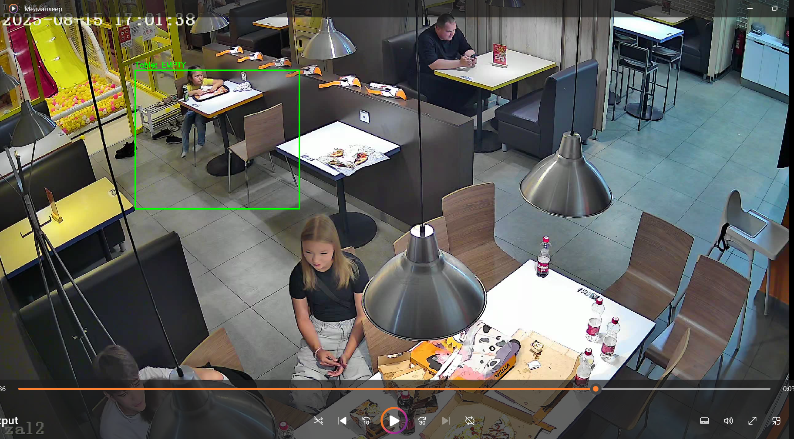

# Прототип системы детекции уборки столиков по видео

Данный проект представляет собой упрощенный прототип системы компьютерного зрения. Цель системы - отслеживать состояние заданного столика (пусто/занят) на видеозаписи и автоматически вычислять время простоя столика между уходом предыдущих гостей и подходом следующих посетителей или персонала (время на уборку).

## 1. Установка и запуск

Для работы проекта требуется **Python 3.8+**. 

1. Склонируйте репозиторий и перейдите в папку с проектом.
2. Установите необходимые зависимости из файла `requirements.txt`:
```bash
pip install -r requirements.txt
```

3. Запустите основной скрипт, передав путь к видеофайлу через аргумент `--video`:
```bash
python main.py --video video1.mp4
```

**Замечание:**<br> При запуске скрипта откроется окно с первым кадром видео. Выделите нужный столик (включая стулья) с помощью мыши и нажмите `ENTER` или `SPACE` для старта обработки.

## 2. Описание реализации

*   **Выбранное видео и столик:** <br>
    В качестве тестовых данных использовалась 15-минутная запись Видео 1. Целевой столик задается пользователем вручную (через `cv2.selectROI`) на первом кадре. В тестовом прогоне была выбрана область с координатами `(440, 228, 532, 450)`.
*   **Логика детекции:**
    1.  Для обнаружения людей используется легковесная предобученная модель **YOLOv8n** от Ultralytics.
    2.  Для сохранения контекста модель анализирует весь кадр целиком, после чего математически проверяется пересечение найденных людей с координатами выделенного столика.
    3.  Добавлен механизм защиты от ложных срабатываний: стол переходит из статуса `OCCUPIED` в статус `EMPTY` только если в зоне столика нет людей непрерывно более 3 секунд.
    4.  Время простоя (уборки) рассчитывается как разница между временной меткой события ухода (`leave`) и меткой последующего подхода к столу (`approach`).
    5.  Детекция нейросетью выполняется каждый 10-й кадр для оптимизации ресурсов, но визуализация (bounding boxes и таймеры) отрисовывается на каждом кадре, чтобы итоговое видео было плавным.

## 3. Результаты работы


*(Краткий пример смены статуса столика)*

По итогам обработки тестового видео получена следующая базовая аналитика:
*   **Количество полных циклов (уход -> подход):** 28
*   **Среднее время простоя/уборки стола:** 5.55 секунд
*   **Минимальное время простоя:** 0.50 секунд
*   **Максимальное время простоя:** 41.50 секунд

По завершении работы скрипт автоматически генерирует 3 файла:
1.  `output.mp4` - итоговое видео с визуализацией статусов и таймером.
2.  `events_log.csv` - Pandas DataFrame с временными метками всех событий (зафиксированные статусы, типы событий и вычисленное время).
3.  `report.txt` - текстовый отчет с базовой статистикой.

## 4. Ограничения и проблемные кадры

Поскольку прототип использует базовую модель без сложной логики трекинга (т.е.без DeepSORT,BotSort и т.д.), в ходе тестирования были выявлены следующие краевые случаи:

1.  **Окклюзия (перекрытие):** <br> Когда мимо стола медленно проходят другие люди (гости или официанты), они визуально перекрывают сидящего человека. Модель временно "теряет" сидящего гостя. Если такое перекрытие длится дольше заданного порога (3 секунды), система может ложно пометить стол как свободный.
2.  **Детекция детей:** <br> Используемая модель YOLOv8n не всегда уверенно распознает маленьких детей, сидящих за столом, так как в кадре видна только голова и часть туловища. Если взрослый отходит, оставляя ребенка одного за столом, статус может переключиться на `EMPTY`.




